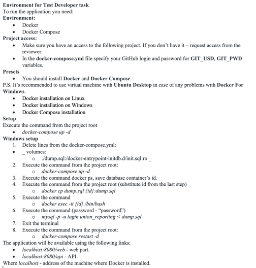
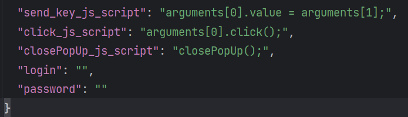

Инструкция по запуску и подготовке среды:
В папке docker-kits-master есть файлы для того,
чтобы выполнить действия по этой инструкции.

После указанных выше действий,
в файле config.json который находится в папке test_data, добавить значения для таких ключей как:
login и password. 

После этого, можете запускать файл: testProjectDataHandler.py в папке tests.
